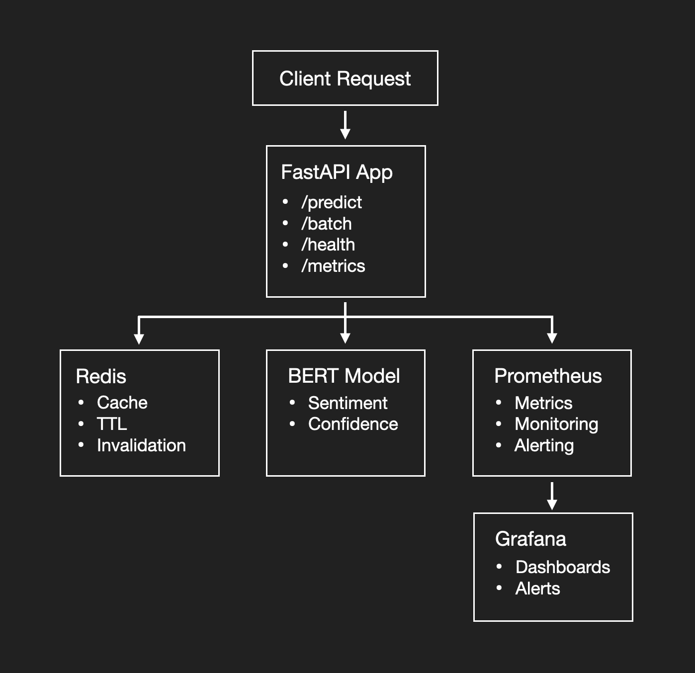

# Real-time Sentiment Analysis API

Real-time API for sentiment analysis, built with FastAPI and Redis.



## Table of Contents
- [Features](#features)
- [Quick Start](#quick-start)
- [API Documentation](#api-documentation)
- [Configuration](#configuration)
- [Monitoring](#monitoring)
- [Development](#development)
- [Contributing](#contributing)
- [License](#license)

## Features

### Core Capabilities
- Real-time sentiment prediction (POSITIVE/NEGATIVE/NEUTRAL)
- Batch processing for high-throughput scenarios
- Automatic model caching and warm-up

### Infrastructure
- Docker containerization
- Redis caching layer
- Prometheus + Grafana monitoring
- Health checks and readiness probes

## Quick Start

### Prerequisites
- Docker 20.10+
- Docker Compose 2.4+

### Installation
1. Clone the repository:  
`git clone https://github.com/znimon/sentiment-analysis-api.git`

2. Start all services:  
`docker compose up -d --build`

3. Verify installation:  
`curl http://localhost:8000/health`

## API Documentation

### Endpoint Summary

| Endpoint          | Method | Description                     |
|-------------------|--------|---------------------------------|
| /predict         | POST    | Single text prediction          |
| /batch_predict   | POST    | Batch predictions               |
| /health          | GET     | System health status            |
| /metrics         | GET     | Prometheus metrics              |
| /docs            | GET     | Interactive API documentation   |

### Sample Request
```
curl -s -X POST http://localhost:8000/batch_predict \                                       
  -H 'Content-Type: application/json' \
  -d '{"texts": ["Great!", "This is awful", "Meh"]}' | jq
```

### Sample Response
```
{
  "results": [
    {
      "text": "Great!",
      "label": "positive",
      "score": 0.9382080435752869,
      "confidence": 0.9382080435752869,
      "processing_time": 0.0,
      "cached": false,
      "request_id": ""
    },
    {
      "text": "This is awful",
      "label": "negative",
      "score": 0.8533598780632019,
      "confidence": 0.8533598780632019,
      "processing_time": 0.0,
      "cached": false,
      "request_id": ""
    },
    {
      "text": "Meh",
      "label": "neutral",
      "score": 0.6232547163963318,
      "confidence": 0.6232547163963318,
      "processing_time": 0.0,
      "cached": false,
      "request_id": ""
    }
  ],
  "total_count": 3,
  "processing_time": 0.6446430683135986,
  "cached_count": 0,
  "request_id": ""
}
```

## Configuration

### Environment Variables
| Variable        | Default Value                                      | Description                |
|-----------------|----------------------------------------------------|----------------------------|
| REDIS_URL       | redis://redis:6379                                 | Redis connection URL       |
| MODEL_NAME      | cardiffnlp/twitter-roberta-base-sentiment-latest   | HuggingFace model name     |
| BATCH_SIZE      | 32                                                 | Batch processing size      |
| CACHE_TTL       | 3600                                               | Cache duration in seconds  |

## Monitoring

### Included Dashboards
1. API Performance Overview
   - Request rates
   - Error rates
   - Latency percentiles

2. System Health
   - CPU/Memory usage
   - Service status
   - Uptime monitoring

## Development

### Project Structure
```
src/
  api/               # FastAPI application code
  model/             # ML model implementation
  services/          # Business logic
  monitoring/        # Metrics collection
```

### Rebuild

`docker-compose down && docker-compose build --no-cache sentiment-api && docker-compose up -d`

### Running Tests
```
pytest tests/unit/       # Unit tests  
pytest tests/integration # Integration tests  
pytest tests             # All tests  
```

## Contributing

1. Fork the repository
2. Create your feature branch (git checkout -b feature/your-feature)
3. Commit your changes (git commit -m 'Add some feature')
4. Push to the branch (git push origin feature/your-feature)
5. Open a Pull Request

## License
MIT License
Copyright (c) 2024 Zechariah Nimon